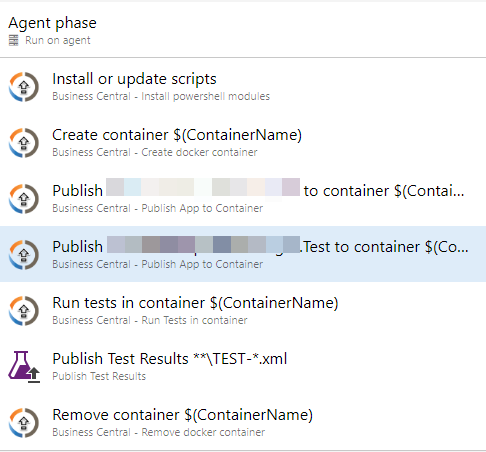
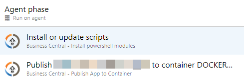
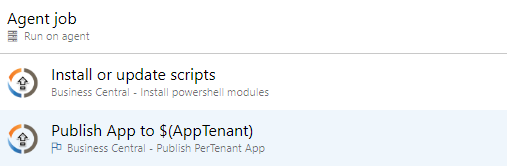
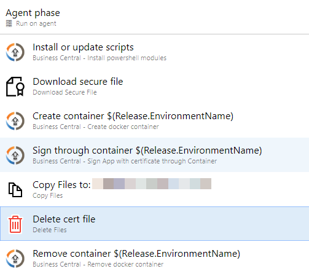

# NaverticAl Tasks

This package includes tasks you can use in your Build/Release pipelines for Microsoft Dynamics 365 Business Central

## Existing tasks

- Install powershell modules
- Create Container
- Sign app through container
- Publish app to container
- Publish PerTenant app to online
- Run Tests in container
- Remove Container

## Planned tasks

- Compile App
- Multi-app support with automatic dependency detections
- Create nuget package
- Get app from nuget

## How to use

On your Azure DevOps account go to the Marketplace, find the extension and install it.
After that, you can use the new tasks in your pipelines through visual designer or yaml, as you wish. Just define the parameters and run the pipeline.

## Example of Release Pipeline to create container, publish the app, test it...

- Install or update scripts
- Create container
- Publish Main App to container
- Publish Test App to container
- Run tests in container
- Publish test results
- Remove container

## Example of Release Pipeline to release the app into QA container...

- Install or update scripts
- Publish Main App to container

## Example of Release Pipeline to release the app online...

- Install or update scripts
- Publish App to tenant

## Example of Release Pipeline to sign the app...

- Install or update scripts
- Download secure file
- Create container
- Sign through container
- Delete file
- Publish signed app artifact

